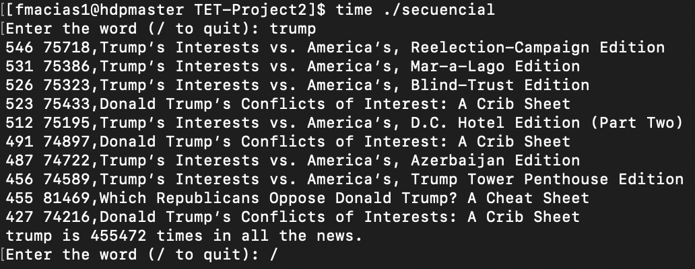
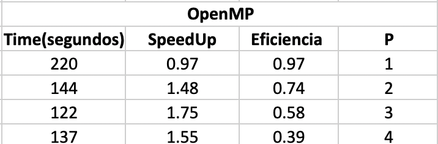
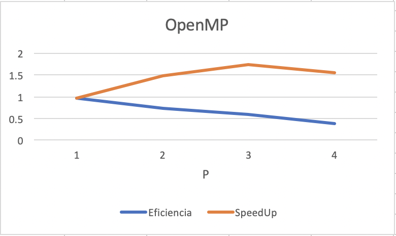
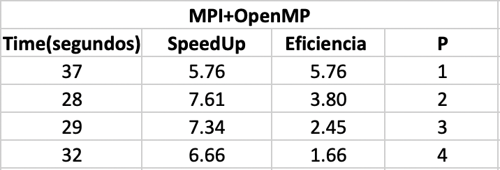
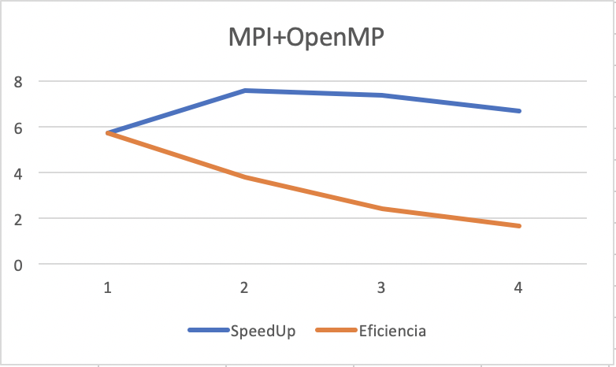

# Tópicos Especiales en Telemática Proyecto 2: Analítica de Texto - HPC

- Douglas Ardila Garcés dardila5@eafit.edu.co
- Andrés Felipe Avendaño aavenda1@eafit.edu.co
- Felipe Macías Herrera fmacias1@eafit.edu.co

# Videos sustentación
- Serial: [Video](https://www.youtube.com/watch?v=T5xmjTie4TU)
- OpenMP: [Video](https://youtu.be/FDTqBQkjapo)
- MPI:[Video](https://www.youtube.com/watch?v=ukqgh4f30nc&feature=youtu.be)
- MPI + OpenMP: [Video](https://www.youtube.com/watch?v=Up8j8VKnJAo&feature=youtu.be)

## Diseño bajo multihilos con el acercamiento OpenMP

- Documentación [open.md](openmp.md)

## Diseño bajo la metodología PCAM

- Documentación [pcam.md](pcam.md)

## Proceso de compilación y ejecución en el DCA
### Procesamiento de los datasets
- #### Ejecutar

        /opt/anaconda3/bin/python procesarArchivos.py
### Programa secuencial
- #### Compilar

        g++ -std=c++11 secuencial.cpp -o secuencial
- #### Ejecutar

        time ./secuencial
### Programa paralelo hecho con OpenMP
- #### Asignar número de procesadores a usar

        export OMP_NUM_THREADS=2
- #### Compilar

        g++ -std=c++11 openmp.cpp -o openmp -fopenmp
        
- #### Ejecutar

        time ./openmp
### Programa paralelo hecho con MPI
- #### Compilar

        mpic++ -std=c++11 mpi.cpp -o mpi
- #### Ejecutar

        time mpirun -f host.txt -np 3 ./mpi
### Programa paralelo hecho con OpenMP + MPI
- #### Asignar número de procesadores a usar

        export OMP_NUM_THREADS=2
- #### Compilar

        mpic++ -std=c++11 pcam.cpp -o pcam -fopenmp
- #### Ejecutar

        time mpirun -f host.txt -np 3 ./pcam

## Análisis de resultados
- ### Versión serial
        El tiempo que toma el algoritmo para ejecutar en serial es de 213 segundos en el DCA.
        La siguiente imagen representa un ejemplo de ejecución haciendo búsqueda de trump.
        

        

- ### Versión paralela
        El análisis en paralelo se hizo bajo dos arquitecturas: OpenMP y MPI+OpenMP.
        Para ambos casos se realizaron ejecuciones con 1,2,3 y 4 hilos.
        Los resultados al implementar OpenMP pueden evidenciarse en la siguiente tabla y gráfica.
        

        

        

        El tiempo que toma el algoritmo para ejecutar en paralelo (solo MPI) es de 36 segundos en el DCA.
        Los resultados al implementar MPI+OpenMP pueden evidenciarse en la siguiente tabla y gráfica.
        

        

        

        Con base en lo anterior, puede concluirse que la implementación de OpenMp y MPI mejoran el speedUp y la 
        eficiencia del algoritmo. Sin embargo, el aumento en el número de los hilos no siempre aumenta el speedUp,
        inclusive en algunos casos entre más hilos, este se ve afectado de manera negativa.
        
