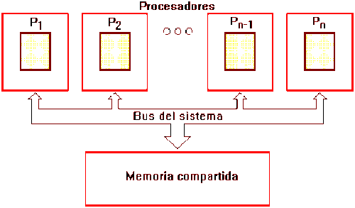

# Diseño bajo multihilos con el acercamiento OpenMP

## ¿Qué es OpenMP?
OpenMP es una interfaz de programación de aplicaciones para la programación multiproceso de memoria compartida en múltiples plataformas. Se compone de un conjunto de directivas de compilador, rutinas de biblioteca, y variables de entorno que influyen en el comportamiento del tiempo de ejecución. 

OpenMP se basa en el modelo fork-join, paradigma que proviene de los sistemas Unix, donde una tarea muy pesada se divide en K hilos (fork) con menor peso, para luego "recolectar" sus resultados al final y unirlos en un solo resultado (join). Ver figura 1.

        

Figura 1.

## Implementación

La estructura secuencial es aquella en la que una acción (instrucción) sigue a otra en secuencia. Las tareas se suceden de tal modo que la salida de una es la entrada de la siguiente y así sucesivamente hasta el fin del proceso.

En las ciencias de la computación, un algoritmo paralelo, en oposición a los algoritmos clásicos o algoritmos secuenciales, es un algoritmo que puede ser ejecutado por partes en el mismo instante de tiempo por varias unidades de procesamiento, para finalmente unir todas las partes y obtener el resultado correcto.

Bajo esta metodología lo que hicimos fue paralelizar el bloque de código en donde se hace el conteo de cada palabra presente en cada artículo, ya que esta parte del programa es la que más toma tiempo, toma casi que la totalidad de la ejecucion del programa.

Video: [Sustentación OpenMP](https://youtu.be/FDTqBQkjapo)
