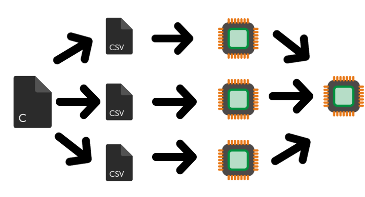
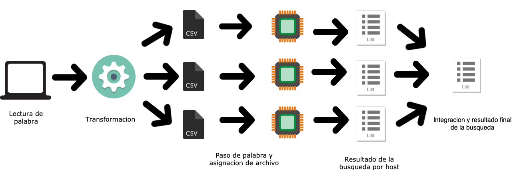
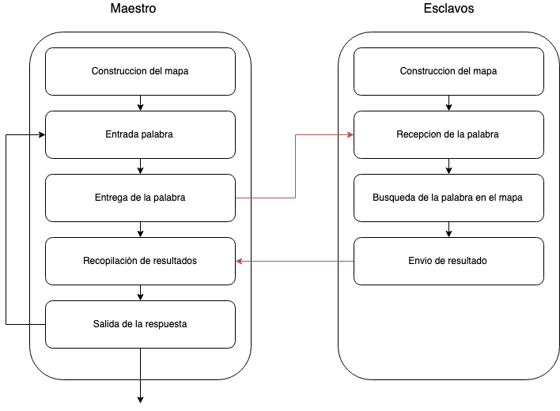

# Diseño bajo la metodología PCAM
- #### Propuesta
Para la implementación de MPI se pensó en un esquema donde se distribuyen los diferentes archivos csv para cada host, como se muestra en la imagen 1.

        

imagen 1.

- ### Descomposición

        

imagen 2.

Descomposición del dominio(datos)
 - Lectura de archivos (Entrada): Cada archivo será leído y despues procesado por un procesador.
 - Archivos con las 10 mayores frecuencias: Posterior del procesamiento de los archivos y encontrado las 10 mejores frecuencias en cada uno, se hace una última comparación con el objetivo de generar sólo las 10 mejores frecuencias entre todo los archivos. Esto puede ser evidenciado en la figura 2.

Descomposición funcional

 - Conteo de apariciones de palabra por archivo y noticia.
 - Ingreso de la palabra a buscar
 - Envío de la palabra y asignación de archivo a cada host.
 - Recopilación de datos por cada archivo
 - Generación de las 10 noticias con el mayor número de palabras por todos los archivos.
 - Ordenar de mayor a menor según el número
 - Impresión de resultados.

- ### Comunicaciones
En esta etapa se define como va a ser la comunicacion, entre quienes se comunican y que se envian, para nuestro proyecto propusimos que la comunicacion se hará entre el nodo maestro y los esclavos, enviandonos en el sentido maestro-esclavo la palabra que se va a buscar, y en el sentido esclavo-maestro se va a enviar el resultado de la busqueda, dividido en dos envios diferentes, que son la noticia y el numero de veces que aparece dicha palabra en esa noticia, logrando asi minimizar el numero de paso de mensajes entre los nodos que podiran disminuir el rendimiento del programa.
- ### Aglomeración

Para el tercer paso, es necesario entender la posibilidad de particionar las tareas repetitivas pero independientes en diferentes procesadores, para así obtener mejores velocidades en el momento de buscar la frecuencia de una palabra en una noticia, disminuyendo al máximo el número de veces que se tengan que comunicar entre los nodos, posterior a esto, recopilar estas frecuencias y definir las 10 con mayor número.

- ### Mapeo

        

imagen 3.

En esta etapa se definen y estructuran las tareas que serán realizadas por cada host, en la figura 3 se muestra un esquema donde se tiene un nodo maestro y 2 esclavos. En este caso el nodo maestro tendrá a cargo el proceso de captar la palabra a buscar, el paso de la palabra a los nodos esclavos y a la recopilación de las frecuencias generadas por los nodos esclavos para que posterior dar las 10 mejores frecuencias. Los nodos esclavos tendrán la tarea de acceder, recopilar y analizar la frecuencia de la palabra ingresada en cada noticia y de recopilar las 10 mejores ordenadas de forma descendente. De esta manera, no se tiene comunicación entre los nos nodos esclavos con el fin de evitar la dependencia entre procesos.

